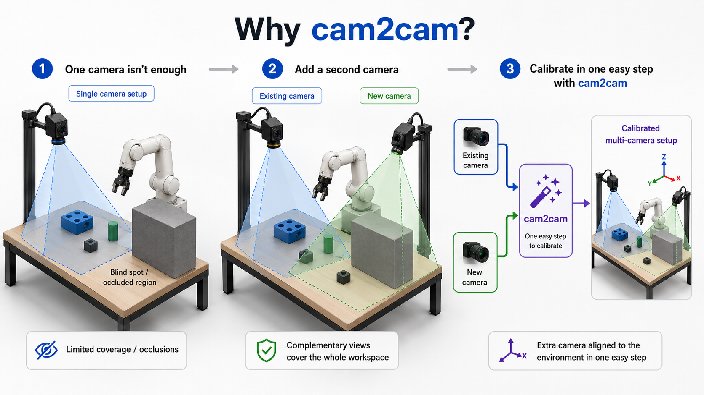
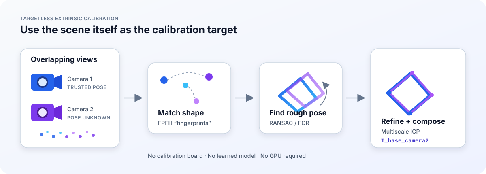
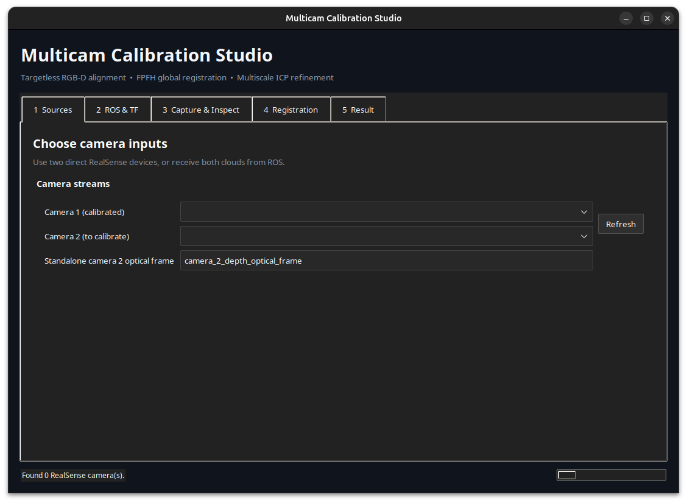
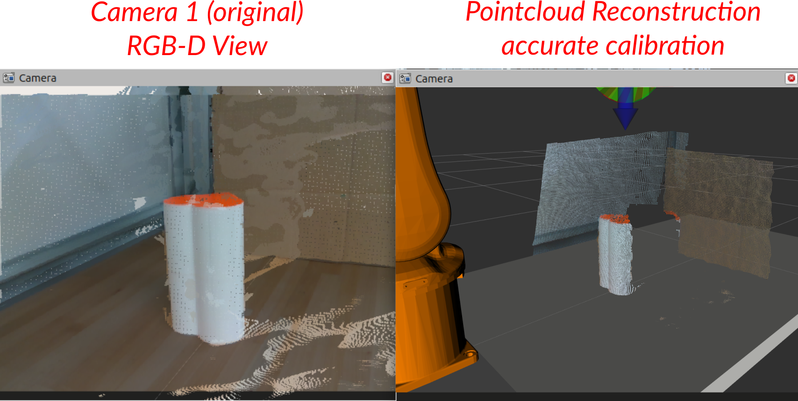
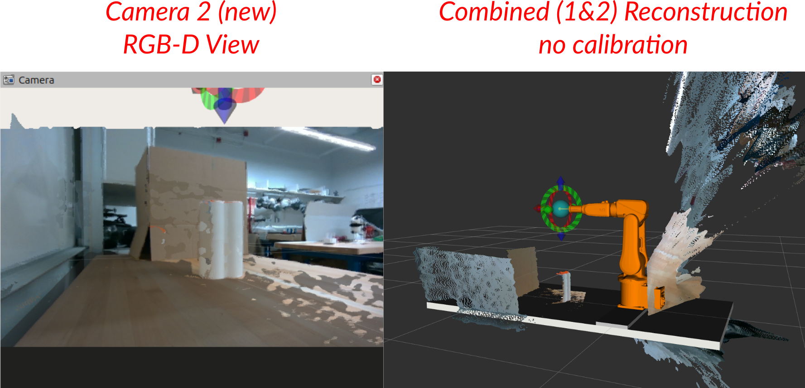
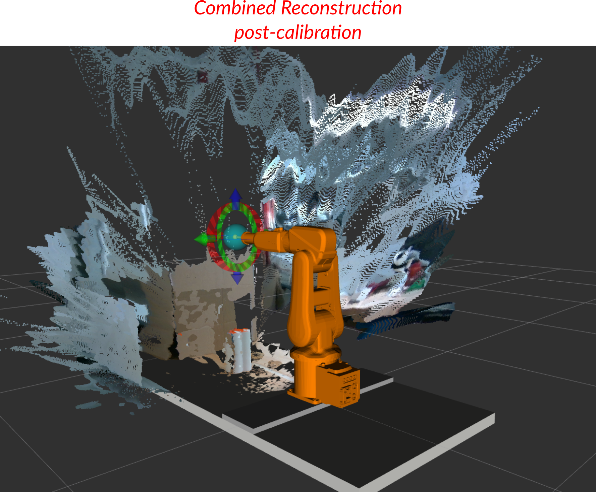

# cam2cam - Multicam ICP Calibration

Add a second (or more) RGB-D camera to your robotics setup with ease. Use it
as a standalone Python tool or integrate it with ROS 2.

## Motivation

Ever look at your robotics setup and think *"I need another camera in the mix"*? A second view can expand the perception stack's field of view or improve visibility of partially occluded objects.

### The usual approach

To make depth/stereo cameras useful, one often has to accurately locate it in 3D space with respect to world coordinates. Handeye calibration has come a long way (see [MoveIt](https://moveit.picknik.ai/humble/doc/examples/hand_eye_calibration/hand_eye_calibration_tutorial.html)), but generally requires several viewpoints, ArUco/ChArUco boards, custom end effector fixturing, etc. **You get the point.** And that's just one camera. Adding another introduces a second view of the same workspace that must agree with the robot's existing coordinate system.

### Good news: there's a better way.

`cam2cam` estimates camera 2's pose relative to an already-calibrated camera 1 by registering their point clouds. It uses Open3D, FPFH descriptors, global RANSAC (with Fast Global Registration as a fallback), and multiscale
point-to-plane or colored ICP. It does not require a calibration board, GPU, Torch, or a learned model.





Under the hood, the tool:

1. Extracts distinctive local-shape "fingerprints" (FPFH) from both clouds;
2. Matches those features to estimate a rough alignment with RANSAC; and
3. Tightens the alignment with multiscale ICP.

The result is camera 2's pose relative to the trusted camera 1 OR relative to world coordinates. Your choice.

## Installation

```bash
git clone https://github.com/hylander2126/cam2cam.git
cd cam2cam

# from a virtual environment
python3 -m pip install -r requirements.txt
```

On Ubuntu, the GUI may also require:

```bash
sudo apt install python3-venv python3-tk
```
<!-- 
`requirements.txt` installs the local package in editable mode, along with the
GUI and direct RealSense dependencies. To install only the reusable
registration core:

```bash
python3 -m pip install -e .
``` -->

## Quick start

Launch the GUI:

```bash
python3 -m icp_calib.gui
```


Then:

1. Select camera 1, whose pose is already trusted, and camera 2, whose pose is
   unknown.
2. Enter or import camera 1's transform if the result should be expressed in a
   robot or world frame.
3. Capture both clouds and adjust their depth limits.
4. Run registration and inspect the aligned overlay and quality metrics.
5. Export the accepted transform.

### Registration modes and the camera 2 guess

The GUI registration modes use different initializations:

- **FPFH global + ICP** ignores the camera 2 XYZ/RPY guess. It matches FPFH
  geometry descriptors, uses randomized RANSAC to obtain an unconstrained
  initial transform, and then runs multiscale ICP. Open3D may report that too
  few correspondences survived its *mutual filter* and that it is falling back
  to the original correspondences. That message means the descriptor matching
  was relaxed; it does not mean the manual pose guess was used.
- **Approximate pose + ICP** skips FPFH and RANSAC. It converts the entered
  camera 2 pose into the camera-cloud frames and uses that transform to seed
  multiscale ICP. A rough estimate should describe both where camera 2 is
  located relative to the base and the direction in which it is looking.
- **Automatic pose-guided (consensus)** generates independent RANSAC and FGR
  candidates plus a seeded-ICP candidate when a rough pose is supplied. It
  refines and scores every candidate at the same fixed tolerance, groups
  similar poses, and accepts only a uniquely supported cluster. The rough pose
  is optional and acts as a soft plausibility tiebreaker. This is the GUI
  default and recommended mode.

FPFH/RANSAC is randomized, so repeated global runs on the same captured clouds
can produce different candidates when the scene is ambiguous. A log entry such
as `Global RANSAC: fitness=...` means global initialization found a candidate;
the calibration can still be rejected later if fine ICP does not meet the
final fitness and RMSE checks. The fitness values from different ICP scales are
not directly comparable because their voxel sizes and correspondence radii
differ.

### What automatic consensus does

Automatic consensus is a reliability layer around the existing solvers:

1. Generate four independent FPFH/RANSAC poses and one FGR pose.
2. Add a seeded multiscale-ICP pose when the user supplies a rough guess.
3. Refine every hypothesis through the same multiscale ICP pipeline.
4. Evaluate both cloud directions at one fixed correspondence distance.
5. Cluster transforms that agree within `0.02 m` and `5°`.
6. Prefer clusters compatible with the optional guess, then rank by recurrence.
7. Refuse to export when equally supported incompatible clusters remain or
   fewer than two candidates support the winning pose.

This prevents a loose solver radius from winning merely because it inflates
fitness, and prevents one stochastic global-registration result from being
treated as trustworthy without independent support. It cannot resolve a
genuinely symmetric scene when neither geometry nor the rough pose
distinguishes the alternatives.

### Accuracy expectations and validation

One development capture from a D435/D405 pair was evaluated against independent
base-to-camera transforms. Five consensus runs without a pose guess all selected
the same physical basin. They differed from the composed reference by
`2.3–3.4 cm` in translation and `1.8–2.3°` in rotation. Supplying the reference
as the rough pose produced a `2.26 cm`, `1.80°` difference with `2.73 mm`
bidirectional inlier RMSE.

These figures describe one test arrangement, not a general accuracy guarantee.
An error around `2.26 cm` is useful for coarse scene alignment and camera
placement verification, but it is not high-precision hand-eye calibration.
Applications involving close robot interaction, accurate picking, metrology,
or safety margins should independently validate the result and normally target
sub-centimetre—or task-specific tighter—error.

A low millimetric inlier RMSE does not contradict a centimetric pose error. ICP
can align one shared or weakly constrained surface very closely while the full
six-degree-of-freedom camera pose remains biased. The reference transform also
has its own uncertainty, so report disagreement with the reference rather than
assuming either estimate is exact.

For better accuracy, in approximate order of impact:

- Capture abundant shared, non-planar geometry distributed across the complete
  field of view and at several depths; avoid a dominant plane or symmetry.
- Crop both clouds to the same physical volume. Unmatched foreground and
  background reduce overlap and can bias ICP.
- Keep cameras and the scene rigid, minimize time between frames, accumulate
  clean depth frames, and reject flying pixels or reflective surfaces.
- Supply a measured rough pose so consensus can eliminate physically wrong
  global clusters and include a seeded candidate.
- Validate RealSense depth scale and intrinsics at the actual working range.
- Combine several independent scene/capture pairs in a joint or robust
  multi-view estimate instead of relying on one pair. This is not yet
  implemented by the GUI.
- For precision robotics, validate or refine with a calibrated target and
  multiple viewpoints; targetless single-scene ICP should not be the sole
  metrology source.

Direct capture currently supports Intel RealSense cameras through
`pyrealsense2`. Stop ROS camera drivers or other programs that already own the
devices before capturing.

To inspect or archive a camera's factory depth-to-color/IR/IMU calibration
without running ROS:

```bash
icp-calib-realsense-extrinsics --serial CAMERA_SERIAL
icp-calib-realsense-extrinsics --serial CAMERA_SERIAL --output extrinsics.json
```

This reads the device through librealsense—the same calibration source used by
the RealSense ROS wrapper. The calibration pipeline itself remains in the
native depth optical frame, so depth-to-color extrinsics are diagnostic unless
the geometry is explicitly moved into another sensor stream.

### Example captures

<table>
  <tr>
    <td align="center">
      
      <br>
      <em>Camera 1 original RGB-D view</em>
    </td>
    <td align="center">
      
      <br>
      <em>Camera 2 new RGB-D view</em>
    </td>
  </tr>
</table>

After registration, the combined reconstruction should collapse into a more
consistent view of the shared scene:



*(ignore the noisy cloud, that's just a poorly-tuned camera 2.)*
## ROS 2 usage

What you need to bring: an existing extrinsic (hand-eye) calibration for
camera 1, either as a known 6D pose or a ROS 2 TF publisher launch file. If you
need to create one, see the
[MoveIt GUI-based hand-eye calibration tutorial](https://moveit.picknik.ai/humble/doc/examples/hand_eye_calibration/hand_eye_calibration_tutorial.html).

Run both camera drivers normally, then use the supplied template to attach both
camera TF trees:

```bash
mkdir -p ~/ros2_ws/src
cp -r ros2_templates/icp_calib_bringup ~/ros2_ws/src/
```

`camera_transforms.launch.py` publishes camera 1's known attachment when your
stack does not already provide it, plus a temporary identity attachment for
camera 2. After calibration, replace camera 2's identity values in that same
file with the exported result.

See [ROS 2 setup](docs/ros2_setup.md) for the short end-to-end workflow.

## Python API

```python
import numpy as np
import open3d as o3d

from icp_calib import RegistrationConfig, calibrate, calibrate_consensus

pcd_camera1 = o3d.io.read_point_cloud("camera_1_workspace.ply")
pcd_camera2 = o3d.io.read_point_cloud("camera_2_workspace.ply")
T_base_camera1 = np.eye(4)  # Replace with the trusted base <- camera 1 pose.

config = RegistrationConfig(
    voxel_size=0.008,
    global_voxel_size=0.025,
    refinement="point_to_plane",
)
result = calibrate(
    pcd_camera1,
    pcd_camera2,
    config=config,
    return_result=True,
)

T_camera1_camera2 = result.transformation
T_base_camera2 = T_base_camera1 @ T_camera1_camera2

print(result.fitness, result.inlier_rmse)
```

By default, `calibrate()` returns a NumPy transform matrix. Pass
`return_result=True` to also receive registration metrics and point counts.
For the additive reliability pipeline used by the GUI default, call
`calibrate_consensus(pcd_camera1, pcd_camera2, config, guess=optional_guess)`;
it always returns a `RegistrationResult` and raises `RegistrationError` rather
than choosing between equally supported incompatible pose clusters.

## Features

- Capture two RealSense point clouds directly or receive ROS 2
  `PointCloud2` topics.
- Estimate camera 2's pose relative to a trusted camera without a calibration
  target.
- Review individual clouds, their registered overlay, and quality metrics in a
  GUI.
- Use geometric or colored ICP and optionally provide an approximate initial
  pose.
- Export the result as transform data or a ROS 2 static-transform launch file.

`cam2cam` calibrates one stationary camera at a time. It does not estimate
camera intrinsics, synchronize camera clocks, track moving cameras, or perform
multi-camera bundle adjustment.

## Limitations

This is an early-stage engineering tool, not a certified calibration system.

- Tested primarily on Ubuntu 24.04, Python 3.12, ROS 2 Jazzy, and Intel
  RealSense D400-series cameras.
- Direct camera capture currently requires RealSense. Other RGB-D cameras may
  be used through Open3D or ROS 2, but remain untested.
- Both cameras and the scene must remain stationary during capture.
- Registration requires meaningful overlapping, non-planar geometry; blank
  walls, floors, repeated geometry, and small shared crops are unreliable.
- Always inspect and independently validate the transform before using it for
  robot motion.


## Documentation

- [ROS 2 setup and calibration](docs/ros2_setup.md)
- [Transform conventions](docs/transforms.md)
- [Parameter tuning](docs/tuning.md)
- [Troubleshooting](docs/troubleshooting.md)

Contributions, tested hardware configurations, bug reports, and documentation
improvements are welcome.

## License

[MIT](LICENSE).
